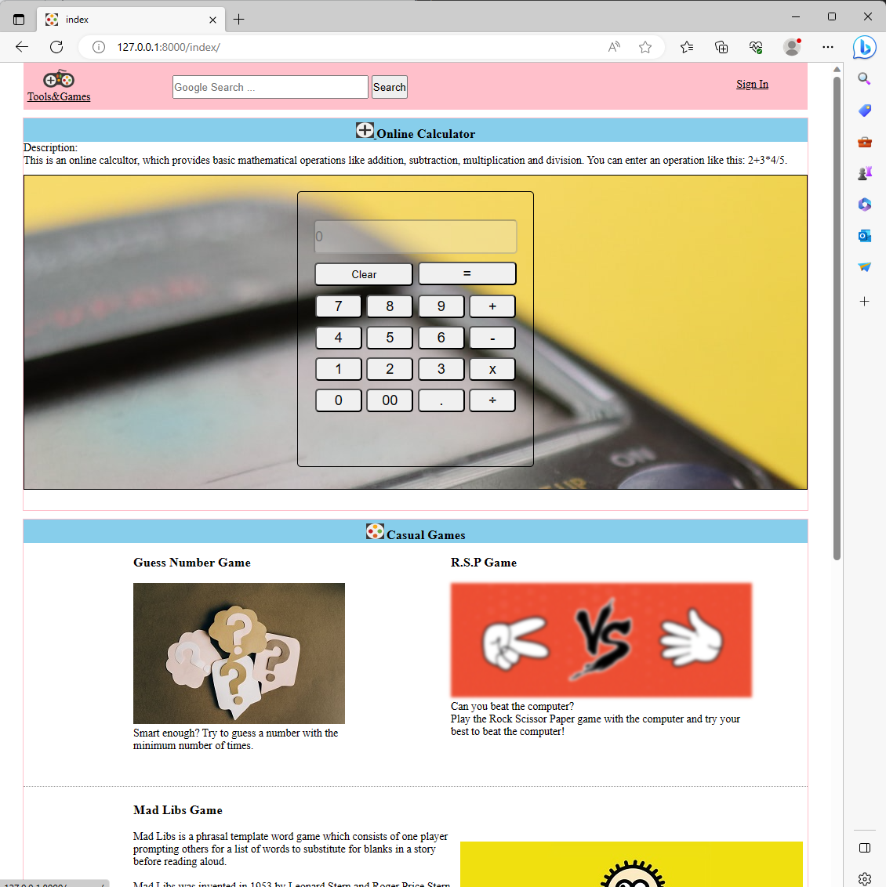

# comIT-finalproject
Django project for comIT web development course. 
It is a very simple and entry level web page with the purpose for web develpment learning. It is using Django, a high-level Python web framework, html and css for the development.

# Web page screenshot:

# Commands reference
1. set up a virtual environment: 
python -m venv env

the last parameter "env" is the name of the virtual environment.

2. activate the virtual environment:
(linux environment): source env/bin/activate
(windows): env/Scripts/activate.bat or env/Scripts/activate.ps1

3. install Django:
python -m pip install django

4. pin your dependencies:
python -m pip freeze > requirements.txt
you will get a txt file named requirements.txt that records all versions for installed software.

5. set up a django project:
django-admin startproject <projectname>

6. start a django app:
python manage.py startapp <appname>

7. project migration:
python manage.py makemigrations

python manage.py migrate  --- this command could be the first command that you will use after cloning this repo

8. run the project:
python manage.py runserver

ps: pls use this address to view the web page: http://127.0.0.1:8000/index/